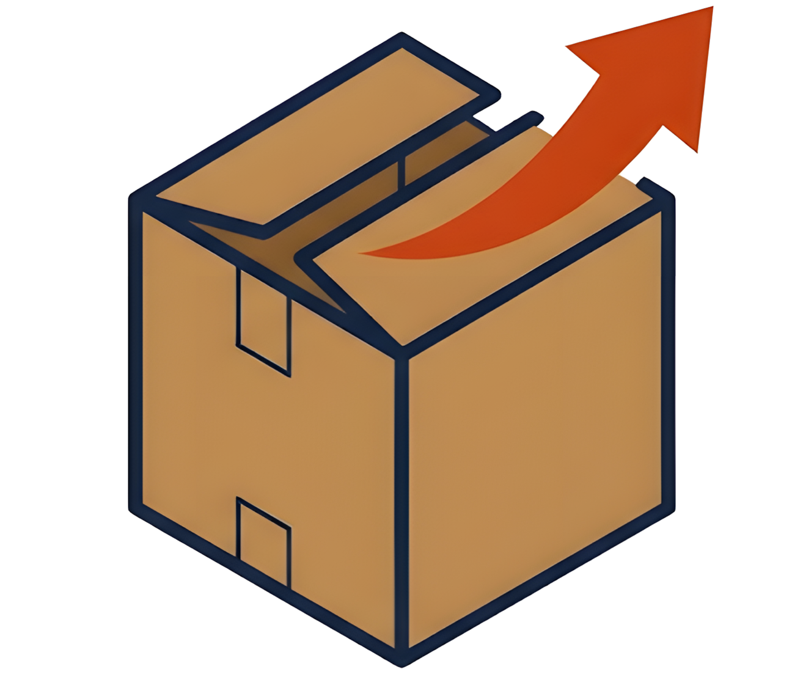
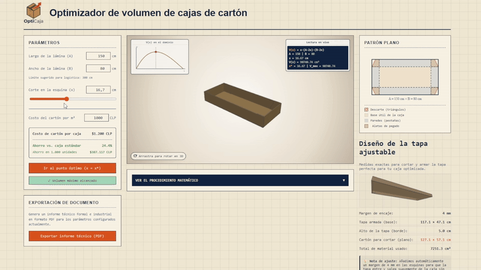
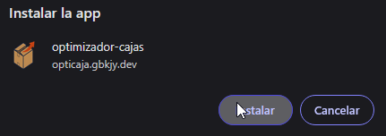
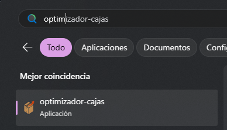
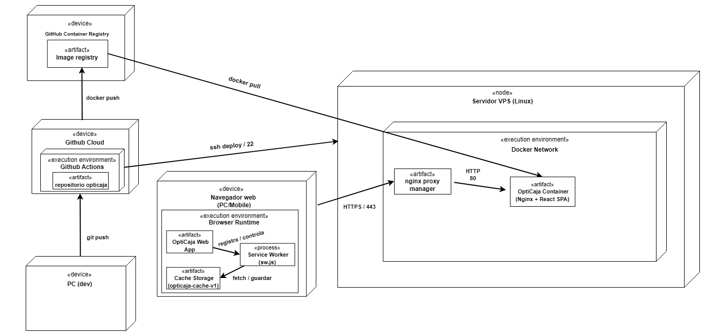

<p align="center">
  
</p>

<p align="center">
  <strong>Plataforma inteligente de optimización de empaques</strong>
</p>

<p align="center">
  <a href="https://github.com/gbkjy/opticaja-react-threejs/actions/workflows/deploy.yml">
    
  </a>
  
  
  
  
  
  
</p>

<p align="center">
  <a href="https://opticaja.gbkjy.dev/" target="_blank" rel="noopener noreferrer">
    
  </a>
</p>

<p align="center">
  
</p>

---

## 💡 Enfoque del proyecto: real vs. académico

La mayoría de los ejercicios académicos de optimización de volumen diseñan una caja partiendo de variables teóricas flotantes (como un volumen fijo dado o una superficie de material infinita).

En el **mundo real de la producción y logística**, un operario en un taller trabaja bajo restricciones físicas reales y conocidas:
1. Las planchas de cartón ya vienen pre-cortadas de fábrica con un **largo (A)** y un **ancho (B)** fijos y predeterminados.
2. La única variable libre es el tamaño del corte de las esquinas (x), que a su vez define la **altura** de la caja resultante al doblar las pestañas.

### 📐 El motor matemático

El volumen V(x) de la caja resultante se modela mediante la función:
```text
V(x) = x * (A - 2x) * (B - 2x)
```

Multiplicando los términos, obtenemos la función polinómica de tercer grado:
```text
V(x) = 4x^3 - 2(A + B)x^2 + ABx
```

Para maximizar la capacidad útil de almacenamiento, el motor matemático de **OptiCaja** calcula en tiempo real la **primera derivada** de la función respecto a x e iguala su resultado a 0 para encontrar los puntos críticos:
```text
V'(x) = 12x^2 - 4(A + B)x + AB = 0
```

Resolviendo mediante la fórmula cuadrática para la variable independiente x:
```text
x = (4*(A + B) - sqrt(16*(A + B)^2 - 48*A*B)) / 24
```

El sistema descarta la raíz fuera del dominio físico y valida que el punto crítico corresponda a un máximo local usando el criterio de la **segunda derivada** (V''(x) < 0):
```text
V''(x) = 24x - 4(A + B)
```

Esto permite calcular instantáneamente el corte exacto de las esquinas para maximizar el volumen útil.

---

## 🚀 Características clave (features)

- **Simulación 3D interactiva (Three.js):** Renderizado tridimensional interactivo de la caja base y su respectiva tapa superior. Permite rotación de cámara, zoom y visualización en vivo de los cambios físicos del cartón.
- **Patrón plano 2D en SVG dinámico:** Un esquema de despiece plano bidimensional interactivo estructurado en tres colores clave:
  - 🟥 **Zona de descarte (scrap):** Esquinas a recortar (rojo `#D9531E`).
  - 🟨 **Base útil:** El fondo real de la caja (kraft `#C1834B`).
  - 🟦 **Pestañas laterales:** Bordes de doblado y ensamble (azul `#3C567E`).
- **Gráfico interactivo de la curva de volumen:** Representación visual interactiva en SVG de la curva V(x), que posiciona un indicador dinámico mostrando dónde está el corte actual frente al punto máximo teórico.
- **Procedimiento matemático paso a paso:** Panel interactivo que desglosa en 5 pasos el procedimiento de derivadas y cálculo numérico real con las medidas configuradas.
- **Generación de reportes PDF en el cliente (100% offline):** Creación de informes técnicos de control de calidad directamente en el navegador del usuario utilizando jsPDF y jsPDF-AutoTable. El archivo PDF se compila y descarga de forma local en el cliente sin enviar datos a servidores externos, garantizando privacidad absoluta y permitiendo el funcionamiento sin conexión a internet.
- **Optimización de tapa telescópica:** Límite inteligente en la altura de la tapa a un máximo de 5 cm (Math.min(corteOptimo / 2, 5.0)), logrando un **ahorro de más del 20% de material de cartón** frente a los diseños redundantes de tapas estándar.
- **Aplicación web progresiva (PWA) e instalación:** Aunque el proyecto es una SPA (Single Page Application) basada en web, está configurada como una PWA. Los usuarios pueden instalarla en la pantalla de inicio de sus teléfonos móviles (iOS y Android) y computadoras (Windows y macOS) directamente desde el navegador, prescindiendo de tiendas como Google Play o App Store. Se ejecuta en una ventana independiente libre de barras del navegador debido a la directiva `display: standalone` en el manifiesto.
  
  **¿Cómo funciona bajo el capó?**
  - **Manifiesto (`manifest.json`):** Provee los metadatos necesarios (nombre, iconos de resolución, color de fondo `#EFE7D3` y color del tema `#12233F`) para que el sistema operativo registre la web como una app nativa.
  - **Ciclo de vida y Service worker (`sw.js`):** Al cargar por primera vez, el navegador registra un service worker en segundo plano que descarga e instala de manera local los recursos estáticos del núcleo (`index.html`, `main.jsx`, `App.jsx`, `App.css` y archivos de configuración) en un almacenamiento de caché local llamado `opticaja-cache-v1`.
  - **Estrategia de resolución (cache-first / fallback):** El service worker intercepta las peticiones de red del navegador de forma que, si el recurso está en caché, lo sirve de inmediato (permitiendo cargar y usar la app 100% offline). Si el recurso no se encuentra en el caché, se realiza la petición normal al servidor.

  **¿Cómo instalar la app en tus dispositivos?**
  *(Nota: Para que el navegador habilite el botón de instalación, la aplicación debe servirse bajo protocolo seguro `https://` o en su defecto en entorno de pruebas local `localhost`).*

  * **💻 En Windows / macOS (Chrome, Edge, Brave, Opera):**
    1. Abre la aplicación en tu navegador.
    2. En el extremo derecho de la barra de direcciones (URL), aparecerá un icono de **pantalla con una flecha hacia abajo** (o un símbolo `+`). Haz clic en él.
    3. Alternativamente, abre el menú de tres puntos del navegador y selecciona **Instalar OptiCaja...**
    4. La aplicación se añadirá a tu menú de inicio y escritorio, abriéndose en una ventana independiente libre de barras del navegador.
    5. *Administración de la app:* Puedes ver, abrir o desinstalar todas tus aplicaciones web instaladas accediendo a la URL especial `chrome://apps` en Google Chrome, o buscándolas directamente en la lista de aplicaciones instaladas de tu sistema operativo (Windows/macOS).

    <p align="center">
      
      &nbsp;&nbsp;
      
    </p>


  * **🤖 En Android (Chrome, Edge):**
    1. Abre la URL en tu navegador móvil.
    2. Aparecerá un banner inferior sugiriendo **Agregar OptiCaja a la pantalla de inicio**.
    3. Si no aparece, pulsa el menú de tres puntos arriba a la derecha y selecciona **Instalar aplicación** o **Agregar a la pantalla principal**.

  * **🍎 En iOS / iPhone (Safari):**
    1. Abre la URL en Safari.
    2. Toca el botón **Compartir** (el icono de un cuadrado con una flecha hacia arriba).
    3. Desplázate hacia abajo y selecciona **Agregar a inicio** (Add to Home Screen).

  **Compatibilidad de instalación por navegador:**

  | Sistema operativo | Navegador | Soporte de instalación | Notas |
  | :--- | :--- | :--- | :--- |
  | **Windows / macOS / Linux** | Chrome, Edge, Brave, Opera | **Completo** | Añade icono al escritorio e inicio; se ejecuta de forma independiente. |
  | **Windows / macOS / Linux** | Firefox | **Parcial (Solo offline)** | Admite la caché y uso sin conexión, pero Firefox eliminó el botón de instalación al escritorio en PC. |
  | **macOS** | Safari (Sonoma+) | **Completo** | Permite ir a *Archivo > Agregar al Dock* para instalar como app standalone. |
  | **Android** | Chrome, Firefox, Edge, Opera | **Completo** | Se añade a la pantalla de inicio y al cajón de aplicaciones del dispositivo. |
  | **iOS (iPhone/iPad)** | Safari | **Completo** | Requiere tocar *Compartir > Agregar a inicio* para fijar el icono en la pantalla principal. |

---

## 📊 Arquitectura y diagrama de despliegue

OptiCaja cuenta con un pipeline de CI/CD automatizado vía GitHub Actions que compila, empaqueta y despliega la aplicación de forma segura en un servidor remoto.

<p align="center">
  
</p>

---

## 🛠️ Stack tecnológico

- **Frontend:** React 19, Vite 8, JavaScript (ES6+), vanilla CSS.
- **Simulación y gráficos:** Three.js (render 3D interactivo), SVG reactivo (plano 2D e histogramas).
- **Reportes y calidad:** jsPDF, jsPDF-AutoTable.
- **Despliegue y distribución:** Docker, Docker Compose, Nginx (contenedor Alpine optimizado para SPA).
- **Calidad de código:** Oxlint (linter ultrarrápido).
- **CI/CD:** GitHub Actions (Appleboy SSH Action, Docker Build & Push Action).

---

## 📂 Estructura del proyecto

El repositorio contiene únicamente los archivos de código fuente, configuraciones y assets requeridos para la ejecución (excluyendo carpetas autogeneradas como `node_modules/` o `dist/`):

```text
.
├── .github/
│   └── workflows/
│       └── deploy.yml          # Pipeline de integración y despliegue continuo (CI/CD)
├── public/
│   ├── iconos/                 # Recursos e iconos de la PWA
│   ├── favicon.svg             # Favicon en formato vectorial SVG
│   ├── manifest.json           # Manifiesto web de la PWA
│   └── sw.js                   # Service Worker (gestión de caché y offline)
├── src/
│   ├── assets/                 # Gráficos estáticos complementarios
│   ├── componentes/            # Componentes React (3D, 2D, SVG y UI)
│   ├── contexto/               # React Context para estado de variables global
│   ├── matematica/             # Lógica matemática (cálculos y derivadas)
│   ├── pwa/                    # Script de inicialización y registro del Service Worker
│   ├── App.css                 # Estilos CSS específicos de la aplicación
│   ├── App.jsx                 # Componente contenedor principal
│   ├── index.css               # Estilos globales y variables CSS
│   └── main.jsx                # Punto de acceso y arranque de React
├── Dockerfile                  # Receta de Docker multi-etapa para producción
├── docker-compose.yml          # Declaración de servicio local o de VPS en producción
├── nginx.conf                  # Configuración personalizada de Nginx
└── vite.config.js              # Configuración de compilación de Vite
```

---

## ⚙️ Instalación y ejecución

### 💻 Ejecución local (desarrollo)

Asegúrate de contar con Node.js v18 o superior.

1. Clonar el repositorio.
2. Instalar dependencias del proyecto:
   ```bash
   npm install
   ```
3. Ejecutar el servidor de desarrollo local con Vite:
   ```bash
   npm run dev
   ```
4. Abre en tu navegador: `http://localhost:5173`

---

### 🐳 Ejecución local mediante Docker

Si prefieres emular la compilación de producción con el servidor Nginx en tu máquina local:

> [!WARNING]  
> El archivo `docker-compose.yml` por defecto utiliza la red externa `proxy-network` para integrarse a proxies reversos (como Nginx Proxy Manager). Si no tienes esta red creada, puedes crearla antes de iniciar con:
> ```bash
> docker network create proxy-network
> ```
> O bien, puedes editar el archivo `docker-compose.yml` y cambiarlo por una configuración de puerto estándar (ej. `ports: - "8080:80"`).

1. Compilar y levantar la aplicación en segundo plano:
   ```bash
   docker compose up -d
   ```
2. La imagen utiliza un contenedor multi-etapa (`node:20-alpine` para compilar y `nginx:alpine` para servir los estáticos), asegurando el menor peso de almacenamiento posible.

---

### 🔑 Configuración de secretos de GitHub (CI/CD)

El pipeline de despliegue continuo en `.github/workflows/deploy.yml` requiere que configures las siguientes variables en la sección de **Settings > Secrets and variables > Actions** de tu repositorio de GitHub para poder ejecutarse automáticamente ante cada push a la rama `main`:

* `HOST`: La dirección IP pública o nombre de dominio de tu servidor VPS de destino.
* `SSH_PRIVATE_KEY`: Tu clave SSH privada asociada a tu servidor VPS, la cual debe tener permisos para conectarse vía SSH, hacer git pull del repositorio y ejecutar comandos de Docker en el servidor.